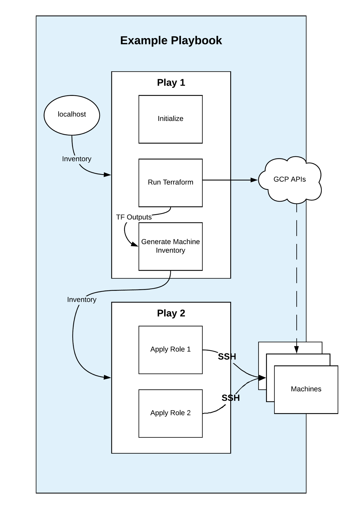

# Running Playbooks

Each stack directory has two Ansible playbooks: one that calls Terraform and one that does not.

## Ansible with Terraform

Each of the subdirectories under `stacks/` contains an Ansible playbook called `playbook.yml` that runs the automation for a full stack build, including calling Terraform as a subtask within the Ansible execution.

As shown in the diagram below, this single Ansible playbook builds the machines and infrastructure for a stack using Terraform, and then runs against the machines to configure SAP. It is not necessary to create an Ansible inventory as it is created dynamically using the outputs received from Terraform.

The initial [play](https://docs.ansible.com/ansible/latest/user_guide/playbooks_intro.html#playbook-syntax) of the playbook runs a Terraform module that builds all of the machines to be used for a given stack, and infrastructure such as load balancers if required. The Terraform module always provides an expected output that is used generate an [inventory](https://docs.ansible.com/ansible/latest/user_guide/intro_inventory.html#intro-inventory) on the fly. After running Terraform and generating this inventory, an Ansible task waits for all of the hosts in the inventory to be accessible over ssh. Subsequent plays of the playbook connect to the machines in the inventory and configure them for SAP.

## Ansible without Terraform

In addition to `playbook.yml`, each of the subdirectories under `stacks/` contains an Ansible playbook called `playbook-notf.yml` that runs only against machines to configure them for SAP. To use `playbook-notf.yml`, the infrastructure must already exist and an inventory must be provided. Each of the READMEs under [stacks](./stacks) has instructions for defining the inventory needed for that particular stack.
