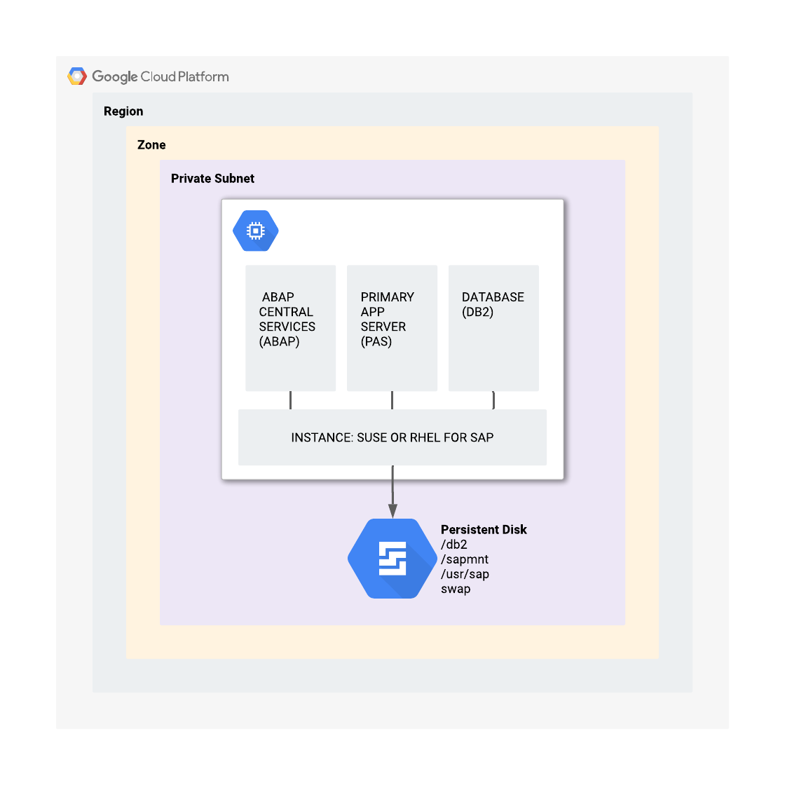

# NetWeaver-DB2-Standard

This stack defines an Ansible playbook and a Terraform root module to deploy the NetWeaver-DB2-Standard stack. A single instance is created that runs DB2, ASCS, and PAS.
# Deployment Architecture



# Requirements

Python 3.5 or greater is required.

Ansible and its dependencies, defined in `requirements.txt` at the root of the repository, will be installed to a local cache directory automatically when using [`ansible-wrapper`](#usage). The correct version of Terraform will be installed by Ansible.

# Variables

Create a variables file using the example at `stacks/NetWeaver-DB2-Standard/vars/deploy-vars.yml`, or see `ansible/roles/nw-db2-standard/defaults/main.yml` for more options.

# Usage

After having created a variables file, use it to either create or delete a stack as shown below. Instructions assume the file is called `vars.yml`.

## Deploy NetWeaver-DB2-Standard stack

From the root of the repository, run:

```
./ansible-wrapper stacks/NetWeaver-DB2-Standard/playbook.yml -e @vars.yml
```

## Destroy NetWeaver-DB2-Standard stack

From the root of the repository, run:

```
./ansible-wrapper stacks/NetWeaver-DB2-Standard/playbook.yml -e @vars.yml -e state=absent
```

# Example playbook

```yaml
- hosts: 127.0.0.1
  connection: local
  roles:
  - role: forminator
    vars:
      sap_tf_project_path: ./tf
      sap_state: '{{ state | default("present") }}'
      sap_tf_version: 0.14.11
      sap_tf_variables:
        disk_size_boot: '{{ sap_nw_disk_size_boot | default(30) }}'
        disk_size_db2: '{{ sap_nw_disk_size_db2 | default(50) }}'
        disk_size_sapmnt: '{{ sap_nw_disk_size_sapmnt | default(25) }}'
        disk_size_swap: '{{ sap_nw_disk_size_swap | default(25) }}'
        disk_size_usrsap: '{{ sap_nw_disk_size_usrsap | default(25) }}'
        disk_type_boot: '{{ sap_nw_disk_type_boot | default("pd-ssd") }}'
        disk_type_db2: '{{ sap_nw_disk_type_db2 | default("pd-ssd") }}'
        disk_type_sapmnt: '{{ sap_nw_disk_type_sapmnt | default("pd-ssd") }}'
        disk_type_swap: '{{ sap_nw_disk_type_swap | default("pd-ssd") }}'
        disk_type_usrsap: '{{ sap_nw_disk_type_usrsap | default("pd-ssd") }}'
        instance_name: '{{ sap_nw_instance_name }}'
        instance_type: '{{ sap_nw_instance_type | default("n1-highmem-32") }}'
        network_tags: '{{ sap_nw_network_tags | default([sap_network_tag | default("sap-allow-all")]) }}'
        project_id: '{{ sap_project_id }}'
        service_account_email: '{{ sap_nw_service_account_email | default("{}@{}.iam.gserviceaccount.com".format(sap_nw_service_account_name | default("sap-common-sa"), sap_project_id)) }}'
        source_image: '{{ sap_source_image | default("") }}'
        source_image_family: '{{ sap_source_image_family | default("") }}'
        source_image_project: '{{ sap_source_image_project }}'
        subnetwork: '{{ sap_nw_subnetwork }}'
        subnetwork_project_id: '{{ sap_subnetwork_project_id | default("") }}'
        zone: '{{ sap_zone | default("us-central1-a") }}'
  tags: [assertions]

- hosts: nw
  become: yes
  vars:
    sap_nw_ascs_virtual_host: '{{ sap_nw_instance_name }}'
    sap_nw_pas_virtual_host: '{{ sap_nw_instance_name }}'
  roles:
  - role: nw-db2-standard
```
